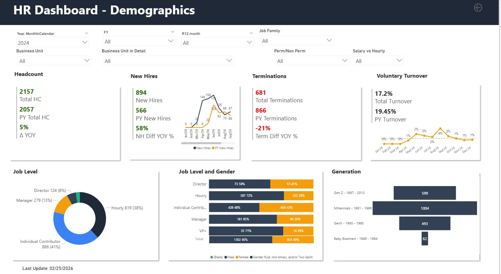
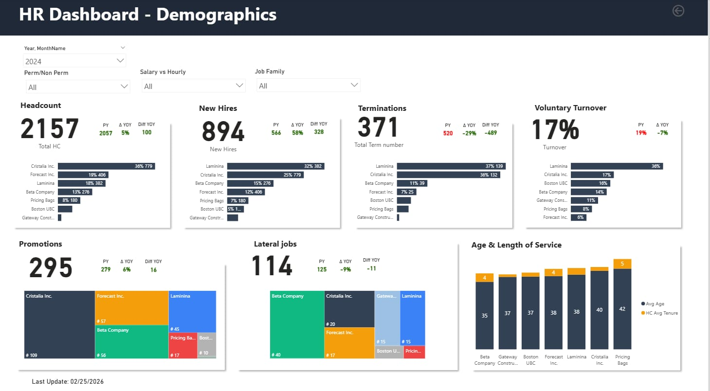
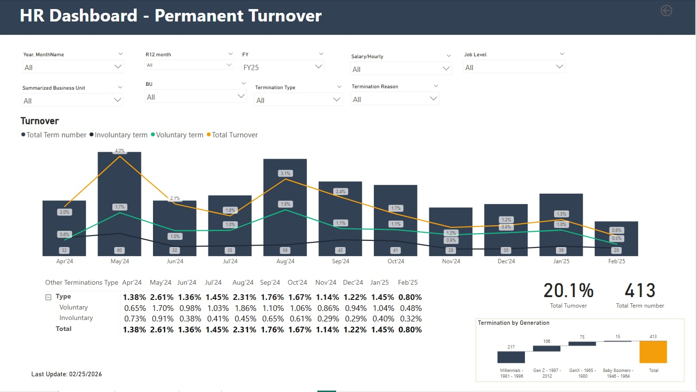

# 📊 Workforce Intelligence Transformation  
### Executive HR Analytics Case Study  

> *Note: All metrics are masked or slightly adjusted to preserve client confidentiality while maintaining analytical integrity.*

---

## 🧩 Business Problem

A mid-sized multi-entity organization (2,000+ employees) lacked executive visibility into workforce dynamics.

Key challenges included:

- Fragmented HR reporting across systems  
- Limited insight into turnover drivers  
- No consolidated view of promotions and lateral mobility  
- Manual executive reporting consuming significant HR capacity  
- Inability to proactively detect flight risk trends  

Leadership required a centralized, strategic workforce intelligence solution.

---

## 🎯 Objective

Design and implement an integrated Workforce Intelligence Suite to:

- Establish a single source of truth for workforce metrics  
- Track headcount, hiring, mobility, and turnover in real time  
- Enable proactive retention and succession discussions  
- Provide demographic transparency for workforce planning  
- Elevate HR reporting from operational to strategic  

---

# 🛠 Solution Delivered

Developed a multi-layered Power BI executive dashboard suite integrating HRIS data into a structured analytics model.

---

## 1️⃣ Workforce Demographics & Headcount Intelligence

### Key Executive Insights

- **2,157 Total Headcount**
- **+5% Year-over-Year Growth**
- **894 New Hires (+58% YoY)**
- **371 Terminations (-29% YoY)**
- **17% Voluntary Turnover**
- 295 Promotions
- 114 Lateral Moves

The dashboard provides breakdowns by:
- Business Unit  
- Job Family  
- Employment Type  
- Gender & Generation  
- Age & Tenure  

**Strategic Outcome:**  
Enabled leadership to understand workforce composition shifts and identify structural talent gaps.

---

## 2️⃣ Talent Mobility & Internal Movement

### Mobility & Succession Signals

- **295 Promotions (+6% YoY)**
- **31% Jobs Filled Internally**
- **55% Internal Fill Rate (People Managers)**
- 114 Lateral Role Changes
- Rising Star & Top Talent visibility
- Flight Risk segmentation (Low / Medium / High)

**Strategic Outcome:**  
Improved internal mobility tracking and strengthened succession pipeline transparency, reducing external hiring dependency.

---

## 3️⃣ Turnover & Retention Intelligence

### Retention & Risk Analytics

- **20.1% Total Turnover**
- **413 Total Terminations**
- Monthly Voluntary vs Involuntary Trend Analysis
- Termination Breakdown by Generation
- Business Unit-level turnover visibility

The dashboard enabled early detection of turnover spikes and generational retention risk patterns.

**Strategic Outcome:**  
Shifted retention conversations from reactive to predictive workforce management.

---

# 📈 Business Impact

- Reduced manual HR reporting by **~70%**
- Improved executive workforce visibility across 2,000+ employees
- Elevated HR from operational reporting to strategic advisory
- Enabled proactive retention interventions
- Strengthened data-backed succession and mobility planning
- Increased confidence in workforce planning decisions

---

## 🔒 Data Confidentiality

All figures are masked or slightly adjusted to preserve client confidentiality while demonstrating analytical capability and solution structure.
